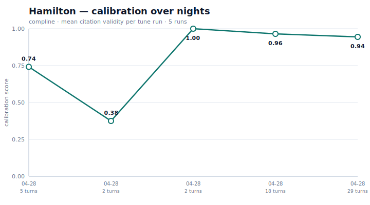

# Compline

> **AI that gets sharper while you sleep.**

Bind a persona to your library — books, podcasts, courses, papers. It cites the page. It argues with the other personas. Every night it scores its own answers, finds where it was vague or wrong, and tunes itself.

*Month two is measurably better than month one. Show me another framework that ships that chart.*



> _The chart above is real — it's the calibration trace from this repo's own demo corpus over its first three tune cycles. The dip you see is a JSON parser bug being caught and fixed. By launch this chart will have 30+ nights and tell a longer story._

---

## What this actually is

A small Python framework for **knowledge-grounded personas that improve over time without retraining.**

You feed it a library — markdown files, PDFs, transcribed podcasts. You define a persona as a markdown file with a few lines of frontmatter. The persona answers your questions in voice, citing the page for every claim. A nightly process reads the day's questions and answers, runs a deterministic check on whether the citations actually appear in the source, and writes one short note to the persona's `margin.md` file. That margin file is auto-loaded into the system prompt the next day.

That single file — `<persona>.margin.md` — IS the persona's accumulated identity. It's inspectable, diff-able, and screenshot-friendly. It's the artifact this whole framework is organized around.

## Quickstart

```bash
pip install compline
export ANTHROPIC_API_KEY=...

# Initialize the database and ingest the bundled Federalist Papers demo
compline init
compline ingest examples/federalist/papers --corpus federalist

# Ask Hamilton a question, watch the citations validate
compline ask examples/federalist/Hamilton.persona.md \
  "What did you mean by 'energy in the executive'?"

# After 5-10 questions, run the nightly tune step.
# This is the bit that lets the persona improve.
compline tune examples/federalist/Hamilton.persona.md

# Look at what the persona learned
cat examples/federalist/Hamilton.margin.md

# When you have multiple tune runs, generate the calibration chart
compline chart Hamilton --output chart.svg
```

That's the whole loop. No GPU. No vector database. No model download. The corpus index is SQLite + FTS5; the only generative LLM call per night is the one that writes the margin note.

## What an answer looks like

Real output from the bundled demo corpus:

> **Q:** What did you mean by 'energy in the executive,' and why did you consider it essential to good government?
>
> **A:** By energy in the Executive, I mean a vigorous capacity to act with force and dispatch. As I have written, "Energy in the Executive is a leading character in the definition of good government." This energy comprises four essential ingredients: "first, unity; secondly, duration; thirdly, an adequate provision for its support; fourthly, competent powers."
>
> ...
>
> A feeble Executive implies a feeble execution of the government. A feeble execution is but another phrase for a bad execution; and a government ill executed, whatever it may be in theory, must be, in practice, a bad government.
>
> ```
> -- citations: 5/6 valid
>   ✓ [673] Federalist No. 70: 'Energy in the Executive is a leading character in...'
>   ✓ [674] Federalist No. 70: 'The ingredients which constitute energy in the Executive are...'
>   ✓ [673] Federalist No. 70: 'It is essential to the protection of the community against...'
>   ✓ [674] Federalist No. 70: 'A feeble Executive implies a feeble execution of the government...'
>   ✓ [679] Federalist No. 70: 'no favorable circumstances palliate or atone for the disadvantages...'
>   ✗ [679] Federalist No. 70: 'They serve to embarrass and weaken the execution of the plan...'
> ```

Each citation is checked deterministically against the cited chunk's text. The 5/6 above isn't a model judgment — it's a literal substring match.

## What the persona learns at night

Real margin entry from the third tune cycle:

> **2026-04-28**
>
> Your citation record is flawless, but your answers risk becoming formulaic recitations of Federalist logic rather than living argument. In Turn 9, you marshalled the tautology defense with precision, yet you stated your chain of reasoning abstractly ("What is a power, but...") without fully grounding the subsequent claims about *what laws* the taxing power licenses. When next asked about the scope or limits of federal authority under an enumerated power, push harder on the boundary question: what *cannot* be done in its name? Your essays contain genuine tension on this point that you have not yet mined.

Tomorrow morning the persona reads that as part of its system prompt, and tomorrow's answers reflect it.

## How it works

```
QA session
   ↓
SQL log (questions, answers, claimed citations)
   ↓
Deterministic checks (literal substring match for every citation)
   ↓
ONE LLM call per night (writes a short, in-voice margin note)
   ↓
<persona>.margin.md  ← inspectable, diff-able, git-able
   ↓
Auto-loaded into next session's system prompt
```

**The discipline that makes the chart honest:**

- Citations are validated by literal substring match against the cited chunk. There is no LLM-as-judge in the validation loop. Either the quote is in the source verbatim or it isn't.
- The nightly tune step makes exactly one generative LLM call. The rest is SQL.
- Each night the persona changes one thing — one prompt edit, one corpus reweight, one margin entry. Slow cooling, not violent quenching. Read each night's git diff and you can see exactly what shifted.

## What's in v0.1

- One persona, one corpus
- Markdown + PDF ingestion (audio via whisper deferred)
- FTS5 retrieval, no embeddings
- CLI only
- ~600 lines of Python, one dependency (`anthropic`), 38 tests, 0.07s suite

## What's deferred

- **v0.2:** multi-persona debate, MCP server (so Cursor and Claude Code see your personas)
- **v0.3:** Obsidian importer / optional embeddings / evaluation harness — pick one based on what users actually ask for
- **v0.4:** citation auditor as standalone CLI, web UI for browsing margin history, hosted demo

If you want any of those sooner, [open an issue](#).

## Why "Compline"

Compline is the last canonical hour, said before sleep. The framework runs its tune step at night. The metaphor wrote itself.

## License

MIT. The bundled Federalist Papers corpus is sourced from [Project Gutenberg eBook #1404](https://www.gutenberg.org/ebooks/1404) and is in the public domain.
